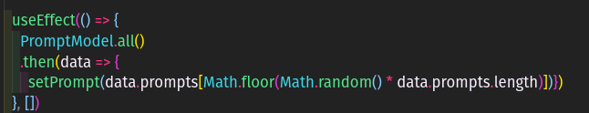
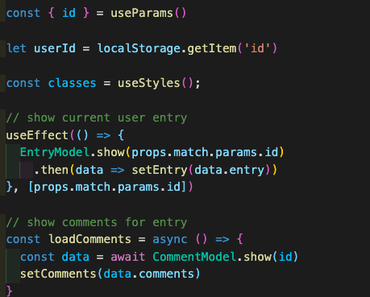

# cuneiform

## Introduction

Cuneiform is a journaling site where we provide a prompt or a quote for inspiration. You can jot down your ideas, set your post for the world to see, or just for you. 

Public posts can be commented on, though we will always show the username so it cannot be anonymous.

We hope to foster creative writers, people who wish to jot down their thoughts, and overall contribute to the written world as our namesake did in the 4th millennium BC.

"Openly he spoke out the words in his heart."

\- an Ancient Mesopotamian poem that gives the first known story of the invention of writing, _Enmerkar and the lord of Aratta_.

## Technologies Used

* Node.js
* React.js
* AJAX
* Material-UI
* Quote API provided by [Rakuten](https://english.api.rakuten.net/) and [Quotes](https://english.api.rakuten.net/martin.svoboda/api/quotes15).

## Getting Started

[Our Trello](https://trello.com/b/jJX36PQ2/cuneiform)

## Unsolved Problems

* Why Paper won't do everything we want it to do in regards to lay out on the page.
* Saving quote or prompt to the entry database.
* Matching a userId from the entry database to the username from the user database.

## Future Enhancements

Please see our backlog on our Trello. 

## Code snippets

## About Us

We are two Software Engineers from General Assembly's Software Engineering Immersive, check us out!

Mario Carbonell [LinkedIn](https://www.linkedin.com/in/mgcarbonell/) [GitHub](https://github.com/mgcarbonell)

Devin Blair [LinkedIn](https://www.linkedin.com/in/devin-blair/) [GitHub](https://github.com/dcblair)

## Thank you

Big thank you to our instructors, [Brock](https://github.com/brockwc), [James](https://github.com/JSinkler713), and Michael (sorry Michael, we couldn't find your GitHub!).

Shout out to the TAs who really helped us through this! [Seanny](https://github.com/SeannyPhoenix), [Jacob](https://github.com/kleimaj), [David](https://github.com/dschawel), and Uyen (we couldn't find your GitHub, sorry!).

The Confirmation Dialog was found via Andrew Bliss @ [JavaScript in Plain English](https://medium.com/javascript-in-plain-english)

We definitely learned a lot from Param @ [Learn With PARAM](https://learnwithparam.com/blog/how-to-pass-props-to-state-properly-in-react-hooks/)

Thank you to [Giphy](https://giphy.com/) for the About/Contact/Help gifs.